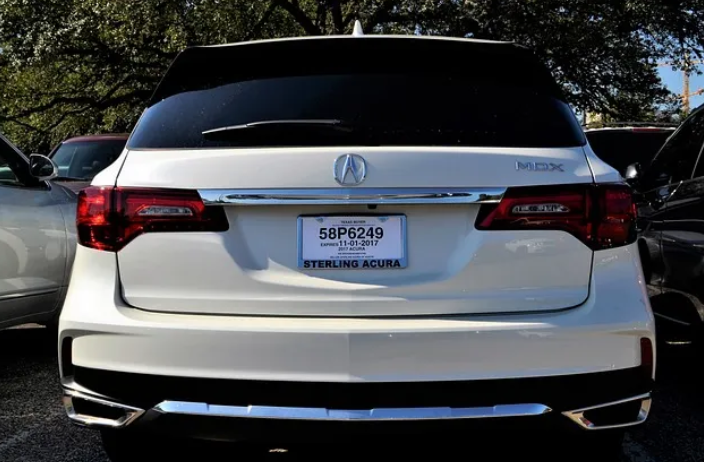
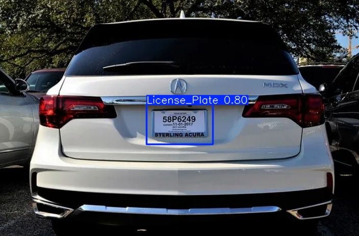

# License Plate Recognition using YOLO11

This project demonstrates license plate recognition using the YOLO11 model, trained with the Ultralytics YOLO library. The model is trained on a dataset and used for detecting license plates in images and videos

## Features
- Uses YOLO11 for license plate detection
- Trained using the Ultralytics YOLO library

2. The detected license plates will be displayed on the image.

## Example Output

Original Image: 

Detected Image:

